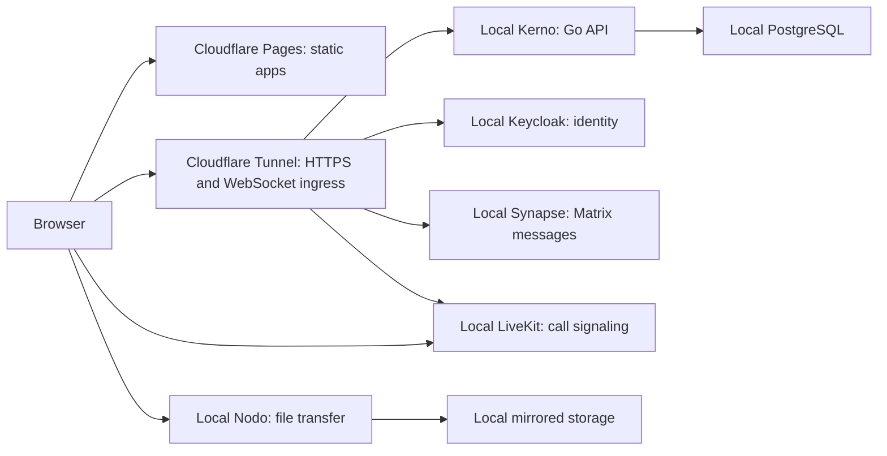

# Kaordo architecture boundary

Scope 0.0.1 establishes package boundaries. Its first working slice is local registration, TOTP and shared account identity.

The browser apps are separately built from one pnpm workspace and assembled as one static Pages site. Shared TypeScript packages hold UI, OIDC integration, account access, API client, contracts, cryptography, and cross-app links.

Kerno is a modular Go service for business data and authorization. Its first routes validate Keycloak access tokens and create the local user record. Nodo is an independent Go service for resumable direct file uploads. The Go workspace keeps both modules buildable together while allowing separate binaries. Local Keycloak and PostgreSQL are defined in `deploy/local/compose.yaml`; Synapse, LiveKit and observability services still have reserved deployment folders.

The initial frontend dependency ownership is:

- Ligo: Matrix JS SDK, TanStack Query and Virtual, Uppy Tus, PhotoSwipe, Video.js.
- Fluo: TanStack Query and Virtual, Tiptap core, Uppy Tus, Pica, PhotoSwipe, Video.js.
- Rondo: Matrix JS SDK, LiveKit client, TanStack Query, Uppy Tus.
- Regado: TanStack Query.
- All apps: Tailwind CSS, shared shadcn-svelte Rhea UI, Bits UI, Lucide, and shared browser packages.

The root Pages build has paths `/`, `/login/`, `/register/`, `/ligo/`, `/fluo/`, `/rondo/`, and `/regado/`. Local authentication and the user projection are implemented. Domain routing, home-server network access, recovery keys and public deployment are not configured.
