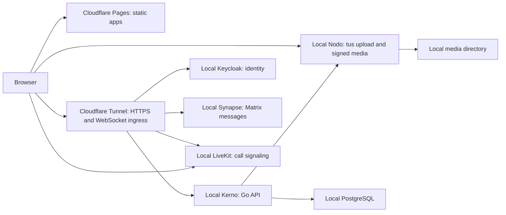

# Kaordo architecture boundary

Scope 0.0.1 establishes package boundaries. Working slices include local registration, TOTP, shared account identity, and Fluo social posting.

The browser apps are separately built from one pnpm workspace and assembled as one static Pages site. Shared TypeScript packages hold UI, OIDC integration, account access, typed API and pagination policy, media upload, contracts, cryptography, and cross-app links.

Kerno is a modular Go service for business data and authorization. It validates Keycloak access tokens, creates the local user record, and stores Fluo posts, comments, quotes, reactions, follows and attachment metadata. Nodo is an independent Go service for authenticated resumable uploads and image/video processing. Kerno checks upload ownership before linking media to a post; accessible post responses receive short-lived signed Nodo links. The Go workspace keeps both binaries and the signing module independently buildable. Local Keycloak and PostgreSQL are defined in `deploy/local/compose.yaml`; Synapse, LiveKit and observability services still have reserved deployment folders.

Fluo uses TanStack Query and Virtual for its cursor feed, Tiptap for structured text, Uppy/Tus and Pica for upload, PhotoSwipe for images and Video.js for video. The remaining app scaffolds do not import Matrix or LiveKit. Each package declares the libraries its source uses.

All apps use the shared Tailwind CSS, shadcn-svelte/Rhea, Bits UI, and Lucide system through `@kaordo/ui`.

The root Pages build has paths `/`, `/login/`, `/register/`, `/ligo/`, `/fluo/`, `/rondo/`, and `/regado/`. Fluo's initial discovery order is reverse chronological with a following filter and a separate own-post view; this works from one account onward without training data. Home-server network access, disk mirroring, private-at-rest encryption and public deployment are not configured.
