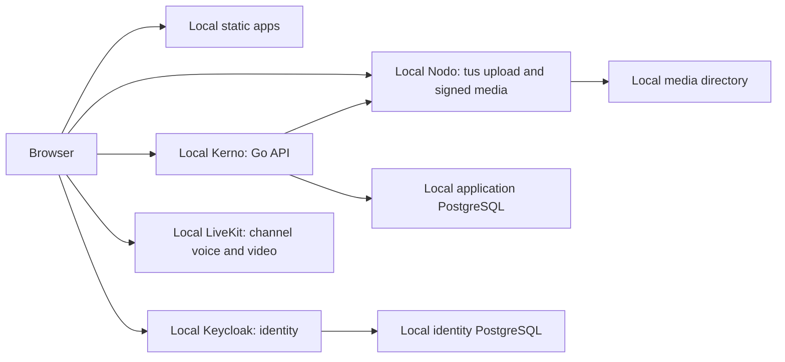

# Kaordo architecture boundary

Scope 0.0.1 establishes package boundaries. Working slices include local registration, TOTP, shared account identity, Fluo social posting, Ligo messaging and Rondo communities.

The browser apps are separately built from one pnpm workspace and assembled as one static Pages site. Shared TypeScript packages hold UI, OIDC integration, account access, typed API and pagination policy, media upload, contracts, cryptography, and cross-app links.

Kerno is a modular Go service for business data and authorization. It validates Keycloak access tokens, creates the local user record, and stores Fluo posts, Ligo messages and Rondo metadata. Nodo is an independent Go service for authenticated resumable uploads, image/video processing, and generic files. Kerno checks upload ownership before linking an attachment; authorized responses receive short-lived signed Nodo links. The Go workspace keeps both binaries and the signing module independently buildable. Local Keycloak, PostgreSQL and LiveKit are defined in `deploy/local/compose.yaml`; Synapse and observability are not deployed by the local Compose stack.

Fluo uses TanStack Query and Virtual for its cursor-paginated feed, Tiptap for structured text, Uppy/Tus and Pica for upload, PhotoSwipe for images and Vidstack for video. Its feed supports Latest and Following; search, saved posts and the user's posts are separate views, with the latter shown on Profile. Notifications and Settings are navigation destinations without implemented product workflows.

Ligo uses the same identity and media boundaries. PostgreSQL stores direct, group, and personal conversations, membership, cursor-paginated message history, unread and delivery cursors, reactions, edits, deletion tombstones, and idempotent send IDs. A dedicated PostgreSQL LISTEN connection sends membership-scoped change hints over authenticated SSE; the browser reloads pages via TanStack Query and uses native scrolling with explicit history anchoring. Nodo accepts up to eight attachments per message, including arbitrary files served as downloads. The SvelteKit app uses shared shadcn-svelte/Rhea Message, Bubble, Attachment, Context Menu, Dropdown Menu, Dialog, Avatar, and Textarea components. Ligo has no end-to-end encryption or Matrix integration. Rondo stores server and channel metadata in PostgreSQL and reuses Ligo's message, membership, reaction and Nodo attachment pipeline for channel text. Server owners can invite members and create channels; public servers support self-join. Kerno signs a short-lived LiveKit token for an authenticated channel member. The browser uses `livekit-client` for voice, camera and screen sharing; video and audio tracks remain inside LiveKit rooms rather than Nodo storage. The local LiveKit profile has no public TURN/TLS or UDP ingress, and self-hosted LiveKit does not invalidate already issued tokens after removal. Regado remains a scaffold. Each package declares the libraries its source uses, and editor/media libraries load only in the views that need them.

All apps use the shared Tailwind CSS, shadcn-svelte/Rhea, Bits UI, and Lucide system through `@kaordo/ui`.

The root Pages build has paths `/`, `/login/`, `/register/`, `/ligo/`, `/fluo/`, `/rondo/`, and `/regado/`. Cloudflare Pages and Tunnel are planned public hosting and ingress, not part of the local deployment. Fluo's initial discovery order is reverse chronological with a following filter; it works from one account onward without training data. Nodo stores uploaded media in a local directory and processes it, but disk mirroring, private-at-rest encryption, independent backup storage, public ingress and production deployment are not configured.
