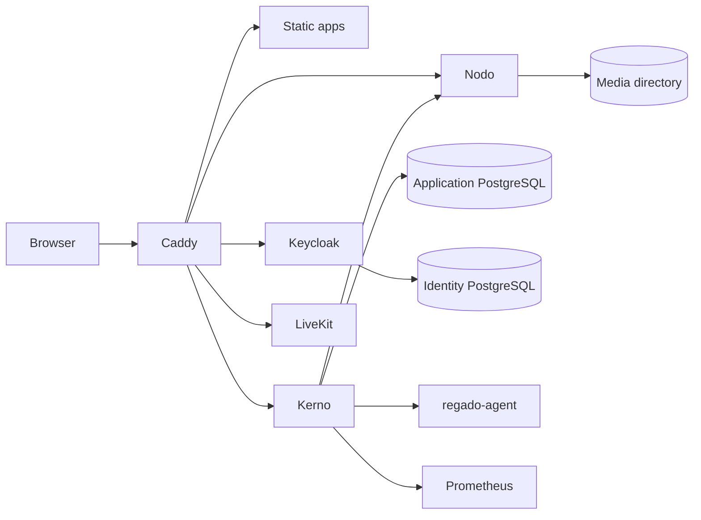

# Architecture

Locally, `pnpm dev` replaces Caddy with a Vite proxy on one origin. In production the NixOS module runs every component as a systemd service (see [production](../deploy/nixos/README.md)).

## Browser

Each app in `apps/` is an independent static SvelteKit build. `pnpm build:pages` assembles them under one origin: `/` (Portal), `/fluo/`, `/ligo/`, `/rondo/`, `/lingvo/`, `/memoro/` and `/regado/`. Switching apps loads a new document. SSO keeps the user signed in across apps.

Shared packages own behavior; apps compose them.

| Package                     | Owns                                                                                     |
| --------------------------- | ---------------------------------------------------------------------------------------- |
| `ui`                        | Tailwind tokens, shadcn-svelte (Rhea) components, Bits UI behavior, Lucide icons, themes |
| `auth`                      | keycloak-js session and in-memory tokens                                                 |
| `account-ui`                | Account gate, device approval/unlock UI, avatars with batched presence                   |
| `contracts`                 | `openapi.yaml` and the generated TypeScript types                                        |
| `api-client`                | Authorized requests, retry, TanStack Query options, Fluo content and audience keys       |
| `crypto`                    | Device keys, signed envelopes, encrypted media and offline recovery                      |
| `chat-client` / `chat-ui`   | Ligo/Rondo queries, SSE sync and idempotent outbox / composer, bubbles and scrolling     |
| `media-client` / `media-ui` | Cancellable tus uploads and image resizing / PhotoSwipe, Vidstack, Cropper.js, geometry  |
| `editor-ui`                 | Shared Tiptap editor and attachment drafts (Fluo, Memoro)                                |
| `voice-client`              | LiveKit connections with E2EE, participant projections and interface sounds              |
| `lingvo-client`             | Encrypted dictionaries, ts-fsrs scheduling, phrase exercises, speech and CSV             |
| `memoro-client`             | Encrypted daily documents, month indexes and media                                       |
| `links`                     | Cross-app URLs                                                                           |

Rules that keep this structure:

- Packages never import apps. A package declares every dependency it imports and imports its own siblings directly, not through its barrel.
- Feature state owns asynchronous work and disposal; views own layout, focus and form interaction. Teardown cancels requests and clears app-owned caches.
- Router-owned history goes through SvelteKit navigation (`pushState`/`replaceState`, `goto`), so URL, selection and dialogs stay in sync.
- Do not reimplement keyboard or focus behavior that Bits UI already provides.
- Pair semantic colors with their foreground (`bg-primary text-primary-foreground`). Use `text-link` for colored text on neutral surfaces.
- Theme palettes live in `packages/ui/src/lib/themes`. `node scripts/sync-theme.mjs` (also run by `build:pages`) generates the Keycloak theme from them.

## Identity

Keycloak owns passwords, TOTP, recovery codes and sessions. Its hosted forms are the only place credentials are entered. The `kaordo-web` client is public, uses Authorization Code with PKCE S256, and has password grant and implicit flow disabled. Registration requires TOTP setup and saving recovery codes.

Access tokens carry `aud=kerno-api`, `sub` and `preferred_username`. Kerno verifies signature, issuer, audience and expiry against Keycloak's JWKS and never accepts ID tokens. Tokens stay in browser memory. A per-tab `sessionStorage` preview keeps the last verified username visible for up to an hour. It is presentation only and never authorizes anything.

`POST /v1/session` idempotently maps the Keycloak subject to a UUIDv7 account row; every other module uses that account ID. Kerno never stores passwords, OTP seeds or refresh tokens. Private responses carry `Cache-Control: no-store`.

## Services

**Kerno** (`services/kerno`) is the API and authorization point. Domain packages (`account`, `admin`, `fluo`, `ligo`, `rondo`, `memoro`, `vault`, `encryption`, `lingvo`) own models, validation, errors and store interfaces. `httpapi` decodes requests, authorizes and maps errors; it depends only on those interfaces. `postgres` implements them with Jet query builders in pgx transactions, split by feature and operation. Access checks run inside the same transaction as the write. `nodoclient`, `regado`, `ntfy` and `rondovoice` are outbound adapters, and `cmd/kerno` wires everything. On shutdown Kerno drains HTTP, stops the alert delivery and LISTEN workers and then closes the pool.

**Nodo** (`services/nodo`) runs tusd for resumable uploads and stores bytes. It asks Kerno to confirm ownership on every upload request. Product media is encrypted on the device and stored as opaque files. Only public profile images arrive in plaintext; Nodo decodes and re-encodes them. Kerno records an upload as a claim when a post, message, profile or Memoro day references it. Once the last reference disappears the claim is retired and Nodo purges the bytes. Unclaimed uploads expire after 24 hours. A failed reference check keeps the bytes for the next pass. `mediaauth` signs the short-lived download URLs Kerno hands out.

**regado-agent** (`services/regado-agent`) runs as root and listens only on a Unix socket readable by Kerno's group. It owns its host's desired state document and a persistent operation journal. It plans pool changes from that document and applies them with btrfs-progs and sgdisk, and it serves device, pool and SMART facts, service status and journals, and allowlisted restarts. Journal retention is part of the desired state. It never runs caller-supplied commands. Kerno checks the current admin role and audits each change, with its JSON diff, before calling the agent. See [Regado host operations](regado.md).

## Products

**Fluo.** Posts, replies and quotes are encrypted with the author's audience key. Public accounts publish that key; private accounts seal it to the accounts they follow, and switching to private rotates it. Profiles, follows, presence and notifications are server-visible. Search over post text runs on the device. Notifications are written in the same transaction as the action that caused them, with a one-hour cooldown per recipient, actor, kind and post.

**Ligo and Rondo.** One PostgreSQL message pipeline serves direct and group chats, Saved messages and Rondo channels. A Rondo channel is a Ligo conversation of kind `channel`, and server membership is mirrored into it. Messages are encrypted per record for the members. PostgreSQL `LISTEN` feeds membership-scoped SSE hints, and the browser refetches through TanStack Query. Rondo calls use LiveKit with end-to-end encryption. Kerno issues short-lived join tokens only to current channel members.

**Lingvo.** Each language pair is a separate dictionary of owner-scoped encrypted vault records with revision-checked writes. Scheduling (FSRS through ts-fsrs) runs on the device. Kerno stores opaque records and serves only the static starter catalog.

**Memoro.** One encrypted document per day, addressed by an opaque day tag, plus an encrypted month summary for calendar indicators. Saves are revision-checked and debounced on the device.

**Regado.** Available at `/regado/` only to accounts with the database `admin` role. Kerno checks the role and the disabled flag on every request. It shows account, audit, storage, journal and Prometheus metadata. No content access, escrow keys or administrator recovery exist.

## Data and contracts

- `packages/contracts/openapi.yaml` is the wire contract. Run `pnpm --filter @kaordo/contracts generate` after editing it.
- `services/kerno/internal/postgres/migrations` holds the schema as [Goose](https://github.com/pressly/goose) migrations. Kerno applies pending ones at startup under an advisory lock. Migrations are forward-only and must stay compatible with the previous release, because a failed deployment restores the old binary but not the schema. Add a new numbered file; never edit an applied one.
- Jet tables in `services/kerno/internal/postgres/jetdb` are generated from the migrated schema. After a schema change run `KAORDO_UPDATE_JET=1 pnpm test:product:db`; CI fails when they drift.
- Production PostgreSQL, media, releases, metrics and secrets live on `Data1`, a two-disk Btrfs RAID1. RAID1 is not a backup.

Matrix/Synapse and Cloudflare are not part of the system. Adding either needs an explicit decision on identity, encryption and data ownership.
