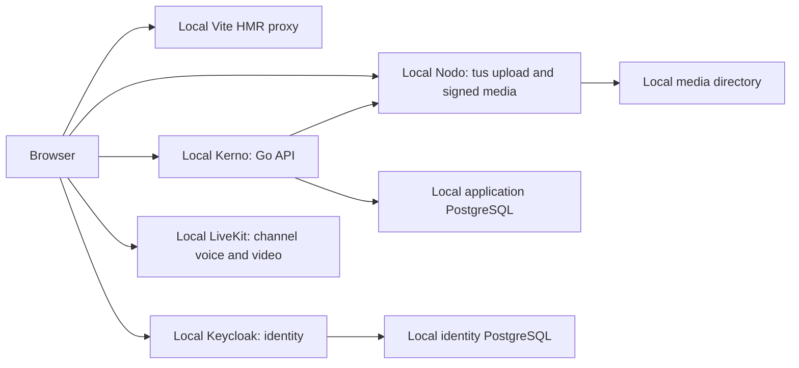

# Kaordo architecture boundary

Scope 0.0.1 establishes package boundaries. Working slices include local registration, TOTP, shared account identity, Fluo social posting, Ligo messaging, Rondo communities, Lingvo language learning, Memoro calendar/tasks/journal and Regado administration.

The browser apps are independent SvelteKit projects in one pnpm workspace. Local development runs one Vite server per app behind a same-origin proxy, preserving auth and API origins while supporting HMR. Release builds are still assembled as one static Pages site. Shared TypeScript packages own UI, OIDC integration, account access, typed API and pagination policy, chat, media, voice, language learning, contracts and cross-app links. The crypto package owns device keys, signed content envelopes, encrypted media and offline recovery. See [encryption and recovery](encryption.md) for threat-model and deployment boundaries.

Kerno is a modular Go service for business data and authorization. It validates Keycloak access tokens, creates the local user record, and stores Fluo posts/settings/notifications, Ligo messages, Rondo metadata, opaque Lingvo/Memoro records, public device identities, sealed key bundles and Regado audit records. Product content is encrypted on devices; routing, membership, access and activity metadata remain visible. Nodo is an independent Go service for authenticated resumable uploads, image/video processing, and generic files. Kerno checks upload ownership before linking an attachment; authorized responses receive short-lived signed Nodo links. The Go workspace keeps Kerno, Nodo, Regado Agent and the signing module independently buildable. Local Keycloak, PostgreSQL and LiveKit are defined in `deploy/local/compose.yaml`; Synapse and observability are not deployed by the local Compose stack.

Fluo uses TanStack Query and Virtual for its cursor-paginated feed, Tiptap for structured text, Uppy/Tus and Pica for upload, PhotoSwipe for images and Vidstack for video. Its feed supports Latest and Following; search, saved posts and the user's posts are separate views, with the latter shown on Profile. Activity notifications persist read state and apply an hourly cooldown to repeated actions. Settings offers per-event notification policies and account privacy through shared Rhea/Bits UI controls. Private accounts share posts only with accounts the author follows; individually private posts remain author-only. Hidden likes increase counts without identifying their actor through notifications.

Fluo profiles use unique account usernames in links and independently editable
nicknames. Profile queries, availability/follow commands and editing drafts have
separate state owners; views compose shared controls and a lazy Cropper.js dialog.
Avatar/banner images use client-side preparation/encryption and transactional upload claims,
including safe retirement after the last reference disappears. Encrypted profile envelopes contain
optional personal details; Kerno stores the selected status and filters presence by mutual
follows/privacy and expires activity after seven seconds. The shared account
gate refreshes a batched avatar/presence snapshot every two seconds in active
apps; feeds and messages keep their own query cadence. Shared Rhea/Bits avatars
show a corner dot and profile images open in PhotoSwipe. Nobody hides both the
dot and the owner's status menu. Only owners whose visibility permits status
receive the raw choice; the initial DruckHeil verification is migration-owned.

Fluo, Ligo, Rondo, Lingvo, Regado and the gate's presentation cache use native
TanStack `QueryClientProvider` lifecycles for focus and online subscriptions.
Each application still owns request cancellation and cache clearing on teardown.

Ligo uses the same identity and media boundaries. PostgreSQL stores direct, group, and personal conversations, membership, cursor-paginated message history, unread and delivery cursors, reactions, edits, deletion tombstones, and idempotent send IDs. A dedicated PostgreSQL LISTEN connection sends membership-scoped change hints over authenticated SSE; the browser reloads pages via TanStack Query and uses native scrolling with explicit history anchoring. Nodo accepts up to eight attachments per message, including arbitrary files served as downloads. The SvelteKit app uses shared shadcn-svelte/Rhea Message, Bubble, Attachment, Context Menu, Dropdown Menu, Dialog, Avatar, and Textarea components. Ligo bodies and attachment keys use signed recipient-encrypted envelopes; Matrix integration remains absent. Rondo stores server and channel metadata in PostgreSQL and reuses Ligo's message, membership, reaction and Nodo attachment pipeline for channel text. Server owners can invite members and create channels; public servers support self-join. Kerno signs a short-lived LiveKit token for an authenticated channel member. The browser uses `livekit-client` with its E2EE key provider/worker for voice, camera and screen sharing; video and audio tracks remain inside LiveKit rooms rather than Nodo storage. The local LiveKit profile has no public TURN/TLS or UDP ingress, and self-hosted LiveKit does not invalidate already issued tokens after removal. Each package declares the libraries its source uses, and editor/media libraries load only in the views that need them.

All apps use the shared STaSBRL stack (Svelte/SvelteKit, Tailwind CSS, shadcn-svelte, Bits UI, Rhea and Lucide) through `@kaordo/ui`. Its catalog provides seven scoped light/dark palettes with Deep Purple as the default. A shared root `ThemeProvider` uses `mode-watcher` for pre-hydration mode, persistence and tab synchronization; `ThemeToggle` lives in app headers, followed by the rightmost `AgordojLink`. The public Portal route `/agordoj/` composes a shared Rhea/Bits UI `ThemePicker` and requires no account request. The Keycloak palette is generated from the same CSS source, and identity entry URLs carry the selected appearance across origins before native forms persist it locally. Interactive login/registration uses Keycloak URL builders without a preceding passive SSO check; the entry route is replaced rather than retained as a second confirmation screen.

Regado is absent from the public app directory and is available at `/regado/` to accounts with the current database `admin` role. Kerno checks that role and the disabled-account flag on every admin request. The dashboard uses shared STaSBRL components and uPlot for Prometheus history. A root Regado agent reads Btrfs, SMART and service journals over a group-protected Unix socket; fixed maintenance actions require an audited reason. User status and role changes are transactional. Content-access cases, their routes/table/UI and administrator key-recovery access are removed. Regado can inspect operational/account metadata, not private content. Device approval and recovery use signatures from user-held keys.

The root Pages build has paths `/`, `/login/`, `/register/`, `/agordoj/`, `/ligo/`, `/fluo/`, `/rondo/`, `/lingvo/`, `/memoro/`, and `/regado/`. The local development profile proxies each Vite server at those paths; production serves the static release. The NixOS production deployment uses Caddy HTTPS at `kaordo.link` with Namecheap dynamic DNS; Cloudflare Pages and Tunnel are not used by that profile. Fluo's initial discovery order is reverse chronological with a following filter; it works from one account onward without training data. Nodo processes uploaded media in its configured directory. Production PostgreSQL, media, metrics, static releases and secrets are stored on Data1, a two-device Btrfs RAID1 filesystem. NixOS has one separate 64 GiB root partition. The current source encrypts user content on devices; deploying it discards earlier plaintext content once through migration 020. An independent backup destination still requires operator configuration. Deployment details are in `deploy/nixos/README.md`.

## Refactored ownership

Lingvo stores a separate private dictionary for each user/learning/native-language
triple in owner-scoped encrypted records. `lingvo-client` owns authoritative
pinned ts-fsrs scheduling, previews, card/review CAS and timezone activity history.
Kerno owns access and opaque persistence and serves only the static starter
catalog.
Views load on demand and compose shared Rhea/Bits UI controls. See
[Lingvo's workflows and boundaries](../apps/lingvo/README.md).

Memoro stores one revision-checked encrypted document per opaque day tag plus an
encrypted calendar summary and opaque month tag. The browser owns date selection,
task drafts, daily rich text and encrypted media; Kerno owns authorization and
shared upload claims. `editor-ui` contains the established Tiptap editor/formatting
and attachment drafts used by Fluo and Memoro. Calendar behavior comes from Bits
UI through `ui`; image/video presentation reuses `media-ui`.

The authenticated gate also owns a device-key session. A first device creates
account keys; another device requires a signed transfer or the user's offline
recovery secret. `crypto` implements these primitives, `account-ui` presents their
lifecycle, and `api-client` adapts wire envelopes to product models and
reconciles Fluo audience keys after follows and privacy changes. Lock/teardown
cancels key-scoped work and revokes decrypted URLs. Public accounts publish their
audience keys; private accounts seal them to followed accounts; profiles are
public presentation and remain clear. No system escrow key exists. The web-client distribution
and initial key-directory trust limits are explicit in [the threat model](encryption.md).

Apps compose feature-specific panels and dialogs; `api-client` owns typed requests and query policies, including Regado cancellation/cache keys. `chat-client` owns Ligo/Rondo message queries, SSE synchronization, uploads and the idempotent outbox. `chat-ui` renders messages and owns composer/scroll interaction. Rondo separates community workflows, voice connection state and community dialogs from navigation/layout. Lingvo separates review/retry/undo state from card gestures and presentation; Regado separates administrative commands from dashboard queries and panels. Fluo publishing consumes document/file values rather than an editor instance. Post and conversation navigation use SvelteKit shallow history APIs.

Go entry points load configuration and wire services. Kerno's domain models/store interfaces are independent of PostgreSQL and incoming HTTP; outbound Nodo, agent/metrics and LiveKit adapters implement the consumer contracts. One router constructor accepts the configured modules, and feature handlers are grouped by operation. The admin SystemOperations service owns fixed-command validation, storage preflight and audited host/Nodo execution through narrow ports. Ligo's conversation dialog and Rondo's device settings separate state/effects from their controls; Fluo consumers depend on the API operations they use. Kerno drains active HTTP requests, cancels and joins its PostgreSQL event listener, then closes the pool. Nodo's quota object owns usage maps and their lock; the upload server owns processing/GC lifecycle. Regado Agent separates its Unix socket/process entry point from `internal/agent` operations and telemetry. Browser state controllers cancel their requests before app-owned caches clear. PostgreSQL files retain the original transactions and access checks; Jet schemas and OpenAPI types remain generated contracts. See the [8 October design-pattern review](audits/architecture-patterns-2026-10-08.md), [architectural review](audits/architecture-2026-10-08.md), [refactor history](refactoring.md) and the dated [7 October quality audit](audits/iso-iec-25010-2023-2026-10-07.md).
