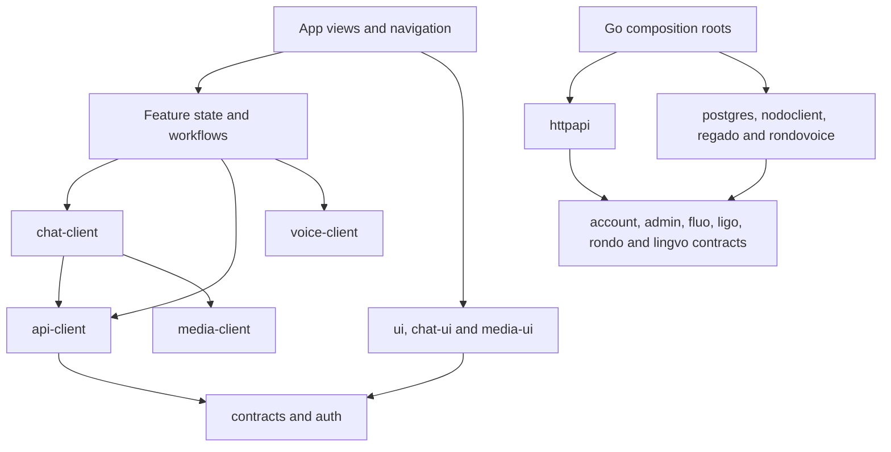

# Architectural refactor — 8 October 2026

## Scope

Reviewed the six SvelteKit apps, shared browser packages, four Go modules and
repository script dependencies. The baseline is
`50ad4b70984806b3ae8041799ff44b2147a02851` on `scope-0.0.4`; this review describes
the uncommitted refactor following that commit. Product workflows, generated
contracts, database migrations and external library versions are preserved.

The objective is maintainable production code with explicit ownership and
dependency directions. A conditional 100/100 remains an engineering target;
this review provides measured structural evidence. It does not establish a
numerical quality certification or complete behavioural equivalence.

## Dependency and ownership model



This diagram shows responsibility directions rather than every import. Shared
packages contain no imports from app implementations. Consumer contracts use
small Go interfaces or TypeScript `Pick` where that reduces coupling.

## Changes

### Kerno

- `account` owns the application user model, store interface and absence error.
  `admin` owns administrative projections, store operations and fixed host
  operation inputs. HTTP consumes these contracts; PostgreSQL translates its
  driver errors at the adapter boundary.
- `nodoclient` owns outgoing metadata, purge and storage-maintenance requests.
  It is separate from incoming HTTP handlers. Agent operations and Prometheus
  history have separate implementation files in `regado`.
- A single `NewRouter` accepts configured modules. Historical constructor
  wrappers are removed. Feature handler files group reads, mutations, media,
  receipts/events and voice operations.
- `cmd/kerno` separates lifecycle, configuration and dependency wiring.
  `postgres.VerifySchema` owns storage prerequisite checks and uses the
  existing Jet/pgx execution helper. Its obsolete exported duplicate is removed.
- `ligoevents` consumes the membership lookup it needs instead of the entire
  messaging store.

Jet statements, transactional writes, role/privacy checks, notifications,
media claims, review serialization and audit ordering retain their existing
owners and boundaries. There is no extra forwarding use-case layer.

### Nodo and Regado Agent

- Nodo's private quota object owns pending/completed usage and its mutex.
  Reservation, completed-upload indexing and file removal retain their prior
  critical sections. HTTP and processing/maintenance handlers call this owner.
- `cmd/regado-agent` owns the Unix socket, signals and HTTP draining.
  `internal/agent` owns protected routes, fixed commands and worker lifecycle.
  Device discovery and host telemetry are separate from snapshot assembly.
  Existing fixtures move with the implementation; command behaviour is retained.

### Browser applications

- `chat-client` replaces duplicated Ligo/Rondo query, SSE, outbox, upload/retry
  and message-mutation workflows. Stable message/attachment IDs, pagination,
  refresh intervals and cache operations retain their existing semantics.
  `chat-ui` owns rendering, composing and native scroll interaction.
- Ligo owns conversation navigation and view selection. Its acknowledgement
  controller owns read/delivery deduplication. SvelteKit owns history state.
- Rondo separates community commands/queries, community dialogs and selected
  voice connection state from navigation and layout. LiveKit lifecycle remains
  in `voice-client`; participant projection and plain snapshot contracts are
  separate from the connection implementation.
- Lingvo separates the due queue, stable review request IDs, uncertain-save
  recovery and undo from gestures, pronunciation and card presentation.
  Authoritative FSRS scheduling and preview configuration are unchanged.
- Regado separates administrative command confirmation, mutation feedback and
  access-case state from dashboard query resources and panel rendering. Form
  state is editable; operation status is exposed read-only.
- Fluo publishing receives document/file values and an explicit media endpoint.
  It has no dependency on the Tiptap instance or attachment-view model.
- Account bootstrap has its own module behind the unchanged public API barrel.
  The shared Dialog imports its overlay directly, removing a self-barrel cycle.

State owners cancel obsolete mutation/upload requests and discard late results
before application caches clear. Uppy owns upload cancellation; TanStack Query
owns query/cache lifecycle. Accepted server-side maintenance jobs retain their
existing independent lifecycle.

## Retained architecture

| Area | Reason for retaining it |
| --- | --- |
| Independent static apps | Keep build/deployment and account-entry boundaries explicit |
| Rhea/Bits UI and Lucide | Existing mature interaction, focus and accessibility primitives |
| TanStack Query and generated OpenAPI | Existing server-state ownership, cancellation, pagination and typed wire contracts |
| Tiptap, Uppy/Tus, Pica, PhotoSwipe and Vidstack | Existing editor, upload, resize and media lifecycle implementations |
| LiveKit and official Go/TypeScript FSRS | Existing call and scheduling implementations with product-specific policy around them |
| Feature PostgreSQL stores | Keep authorization-sensitive SQL and multi-operation transactions cohesive |
| Portal/account controllers | Already separate session ownership from account-entry presentation |
| Deployment and CI scripts | Existing operator workflows and fixture isolation; no workflow changes were needed |

No additional third-party library or framework is introduced. Workspace changes
link the new shared chat package to already installed dependencies.

## Measured evidence

### Structural analysis

A read-only scan used the installed TypeScript, Svelte and PostCSS parsers,
statically resolvable imports and workspace export maps. It examined 19 app/shared workspaces plus repository
scripts: 370 source files. Generated app builds and installed dependencies were
excluded; type imports were analysed separately from runtime imports.

| Constraint | Result |
| --- | --- |
| Workspace dependency cycles | 0 |
| Runtime module cycles | 0 |
| Module cycles including types | 0 |
| Missing direct dependencies or unused runtime dependencies | 0 |
| Domain imports of HTTP/PostgreSQL/pgx/Jet | 0 across 20 local Go packages |
| Existing PostgreSQL query-expression changes | 0 |
| Relocated projection field/JSON-tag mismatches | 0 across 9 account/admin models |

Go AST comparison identified 266 relocated function bodies with unchanged
statements. Changed statements were reviewed for composition, model/error
ownership, quota receivers and lifecycle. Static Svelte text/attribute values
were preserved in the modified Fluo, Ligo, Rondo, Lingvo, Regado and Dialog views,
including the extracted Rondo dialogs. This is source evidence, not a rendered
interaction assertion.

### Composition size

Lines measure the size of the composition surface; they are not a quality score.
Extracted modules have cohesive ownership rather than arbitrary size limits.

| Composition file | Baseline lines | Refactored lines |
| --- | ---: | ---: |
| RondoApp | 811 | 448 |
| LigoApp | 463 | 351 |
| Lingvo Study | 265 | 209 |
| RegadoDashboard | 388 | 261 |
| Kerno main | 312 | 81 |
| Kerno router | 243 | 40 |

### Compilation and static checks

Completed on the refactored working tree:

```sh
pnpm check:front
pnpm build:pages
go build ./services/kerno/... ./services/nodo/... ./services/mediaauth/... ./services/regado-agent/...
go vet ./services/kerno/... ./services/nodo/... ./services/mediaauth/... ./services/regado-agent/...
CGO_ENABLED=0 GOOS=linux GOARCH=amd64 go build ./services/kerno/... ./services/nodo/... ./services/mediaauth/... ./services/regado-agent/...
git diff --check
```

All six app checks reported zero errors/warnings and all static apps built.
Go compilation/vet and the Linux target build passed. Generated OpenAPI/Jet
files, migrations, Go module/checksum files and external lockfile resolutions
have no changes.

Vite reports its default chunk-size warning for the 517.79 kB minified LiveKit
SDK (134.51 kB gzip). The emitted manifest identifies it as `livekit-client.esm`;
its voice and settings importers are dynamic entries. Plain voice models load
through the separate `model` entry point. The warning threshold remains enabled.

Existing Go fixtures were updated for moved internal contracts/paths and compile
under `go vet`. Functional Node/Go/browser/database/live suites were not run in
this request. Full behaviour preservation remains subject to those existing
suites; historical audit/CI results do not verify this working tree. No commit,
push or deployment accompanies this refactor.
